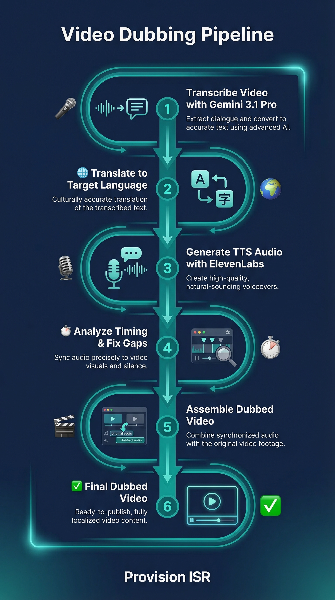

# Provision Video Dubbing

> Full video dubbing pipeline -- transcribe, translate, and dub videos into any language.



## What it does

- Transcribes video with precise timestamps and speaker labels using Gemini 3.1 Pro
- Translates all segments to the target language while maintaining natural pacing
- Generates TTS audio for each segment using ElevenLabs multilingual voices
- Analyzes and fixes timing issues: gaps, overlaps, and speed mismatches
- Assembles the final dubbed video with FFmpeg, with an optional shortened version that removes dead air

## Quick Install

```bash
# Clone into Claude Code skills directory
cd ~/.claude/skills
git clone https://github.com/guyaga/provision-video-dubbing.git

# Restart Claude Code - the skill is auto-detected!
```

## Prerequisites

- **Python 3.10+**
- **FFmpeg** installed and on PATH ([download](https://ffmpeg.org/download.html))
- **Google Gemini API key**
- **ElevenLabs API key**

## Setup

1. Get your API keys:
   - **Google Gemini** (free): https://aistudio.google.com → Get API Key
   - **ElevenLabs**: https://elevenlabs.io → Profile → API Keys

2. Install Python packages:
   ```bash
   pip install google-genai elevenlabs requests
   ```

3. Create a project folder and add your config:
   ```bash
   mkdir my-project && cd my-project
   mkdir -p audio_segments output
   ```

4. Create `config.json`:
   ```json
   {
     "gemini_api_key": "YOUR_GEMINI_API_KEY",
     "elevenlabs_api_key": "YOUR_ELEVENLABS_API_KEY",
     "input_video": "input_video.mp4",
     "target_language": "Spanish",
     "elevenlabs_voice_id": "YOUR_VOICE_ID",
     "elevenlabs_model_id": "eleven_multilingual_v2",
     "elevenlabs_voice_settings": {
       "stability": 0.5,
       "similarity_boost": 0.75,
       "style": 0.0,
       "use_speaker_boost": true
     },
     "output_dir": "output",
     "audio_segments_dir": "audio_segments"
   }
   ```

5. Place your video file in the project folder.

## Usage

Open Claude Code in your project folder and say:
```
Dub this video to Italian
```

Or use the skill command:
```
/provision-video-dubbing
```

## How it works

1. **Transcribe** - Upload video to Gemini 3.1 Pro, get timestamped transcription with speaker labels
2. **Translate** - Send all segments to Gemini for translation, preserving timing and speaker structure
3. **Generate TTS** - Call ElevenLabs API for each segment, measure actual audio durations with FFprobe
4. **Analyze Timing** - Detect gaps, overlaps, and speed mismatches between original and dubbed segments
5. **Fix Timing** - Shift segments into gaps, trim silence, or apply speed adjustments (0.8x-1.5x) to resolve issues
6. **Assemble Video** - Strip original audio, overlay all dubbed segments at correct timestamps using FFmpeg
7. **Shorten (optional)** - Remove extended silence to create a tighter cut

## Files included

| File | Description |
|------|-------------|
| `skill.md` | Skill definition for Claude Code |
| `guide_he.pdf` | Hebrew installation guide (PDF) |
| `infographic.png` | Visual pipeline diagram |
| `templates/` | Ready-to-use Python scripts |

## Templates

| File | Description |
|------|-------------|
| `templates/transcribe_video.py` | Video transcription via Gemini 3.1 Pro with timestamps and speaker labels |
| `templates/translate_segments.py` | Segment translation preserving timing and natural pacing |
| `templates/generate_audio.py` | ElevenLabs TTS generation with per-segment duration tracking |
| `templates/analyze_timing.py` | Gap, overlap, and speed mismatch detection |
| `templates/assemble_video.py` | Final video assembly with FFmpeg audio overlay |
| `templates/config.json` | Configuration template with all available options |

## Built for

[Provision ISR](https://provisionisr.com) - Security camera and NVR solutions

## Powered by

- **Gemini 3.1 Pro** - Transcription & translation
- **ElevenLabs** - Text-to-speech generation
- **FFmpeg** - Video processing & audio assembly

---

*Built with Claude Code*
